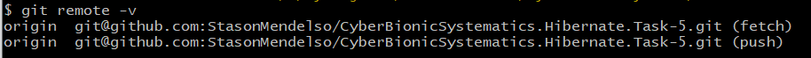

# CyberBionicSystematics.Hibernate.Task-5

## What is the project about?

Repository is for educational purpose - doing a [home-task №5](JDBC%20&%20Hibernate_%20Домашнее%20задание%205.pdf) on
the [course][1] about Hibernate framework.
My fifth task is about adding logging in the code; implementing update method for Author, Book entities; implementing
method of creating books and authors; getting acquainted with benefits of flush() method.

## What is the purpose of this project?

The **purpose** of the project is ***practicing basics*** about the connection to the database and implementing some
operations using only Hibernate, how it should be used correctly to get the *most benefits*.

## Getting Started

As there isn't a real or PET project, it's project about doing the homework from course. So, you need
download the code from the **main** branch for showing the completed task. For this, see the sections below.

### Prerequisites

For running the project you need the next:

* [MySQL Community Server 8.0.31](https://dev.mysql.com/downloads/mysql/) - for running the app with database.
  You need only create an own empty database and configure the Hibernate for connecting (see below).

### Installation Instruction

#### How to download project on my local machine?

For downloading the project locally you can use two variants:

1. Download the ZIP archive from the repository page.

   The method is easy, the next steps helps you:
2. Find the button `Code` and press it.
3. Find the button `Download ZIP` and press it. The downloading must start.
4. Unzip the archive in soe directory and run the IDEA in this directory.

Project has been installed. After opening it in your IDEA, the `Maven` downloads
some additional dependencies.

1. Use the `Git` for downloading the repository locally.

   The method a lit bit difficult, but the project will be downloaded with the help
   of several commands, and not manually, as in the previous method. For this method
   you **need** to [install][4] the `Git Bash` on your computer, make some configuration and have a primary skill of
   using this system of version control.
2. Enter your [name][5], [email][6] of GitHub account locally on your machine.
3. Create an empty directory and initialize it as git repository. Use the next
   command - `git init`.
4. Adds this repository to yours with name `origin` (you can change it, if you want):
    ```
   $ git remote add origin git@github.com:StasonMendelso/CyberBionicSystematics.Hibernate.Task-5.git
   ```
   But you need configure your SSH connection to your GitHub profile in Git Bash. See more [here][7].

   For viewing that the repository has been added successfully to your local
   repository, you need execute the next command and get the following result:
   ```
   $ git remote -v
   ```
   

   After this step your local repository has got a 'connection' to the remote
   project from the GitHub repository.
5. For downloading the project use the following command:
   ```
   $ git pull origin main
   ```
   After these steps your project directory must contain the project files from
   GitHub repository. In addition to, you can create a new branch, make some
   changes and create a pull request for suggesting your improvements. Also, all
   changes are observed by the `git` and you can always make a rollback of
   all changes `git reset --hard`.

#### What things you need to install the software and how to install them

##### Database configuration

For running the database you can use as me MySQL Server or create your own database on another SQL server (**not
recommended**).

For configuring the connection to the database you should change
the [Hibernate configuration properties files](src/main/resources). You can
see, that this file has suffix **.origin**. For enable this file for configurating Hibernate you need remove this suffix
and get the next filename:
*ex_001_config.xml*. You need only insert your username, password and a name of the database.

**Note**: if you use another server not such MySQL
you should change JDBC driver for working with it and configurate the connection to your server in
properly [Hibernate configuration properties](src/main/resources) by changing
configuration of driver name at least. **Also**, for changing the JDBC driver you should change the dependency
in the [pom.xml file](pom.xml).

### Running the application

Before running the application you need to create en empty database with name as you named them. By default, their name
is *library*. Also, you can run the [script](src/main/resources/library/library_db.sql). **Note**: your old database can
be discarded.

## Built With

* [Maven](https://maven.apache.org/) - Dependency Management

## Author

* **Stanislav Hlova** - *All work* - [StasonMendelso](https://github.com/StasonMendelso)

[1]:https://edu.cbsystematics.com/ua/courses/java-jpa-hibernate-orm

[3]:https://en.wikipedia.org/wiki/Java_Database_Connectivity

[4]:https://git-scm.com/downloads

[5]:https://docs.github.com/en/get-started/getting-started-with-git/setting-your-username-in-git

[6]:https://docs.github.com/en/account-and-profile/setting-up-and-managing-your-personal-account-on-github/managing-email-preferences/setting-your-commit-email-address

[7]:https://docs.github.com/en/authentication/connecting-to-github-with-ssh